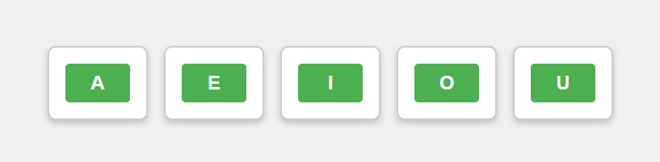

# VowelAudio

VowelAudio é um projeto web **simples** que utiliza a API Web Speech para sintetizar a pronúncia de vogais em português. O objetivo é criar uma interface interativa onde os usuários podem clicar em botões para ouvir a pronúncia de cada vogal.



## Tecnologias Utilizadas

- HTML
- CSS
- JavaScript
- API Web Speech

## Funcionalidades

- Interface simples e responsiva para interação.
- Sintetização de voz para as vogais A, E, I, O, U.
- Compatível com navegadores modernos.

## Como Usar

1. Clone o repositório:
   ```bash
   git clone https://github.com/isaccanedo/VowelAudio.git
